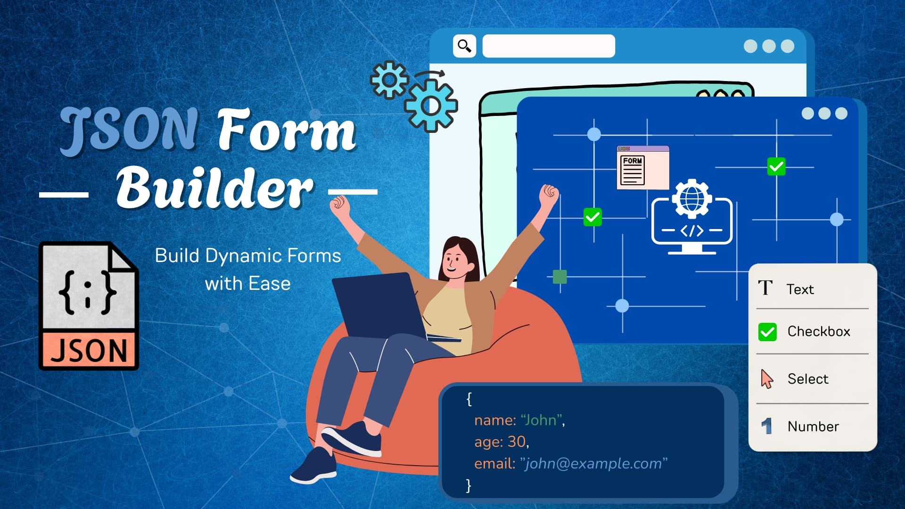

# @tacxou/jsonforms_builder



Form Builder pour JSONForms utilisant le Framework Quasar.

## Prérequis

Ce projet utilise **Bun** comme gestionnaire de packages obligatoire. 

### Installation de Bun

```bash
# Installer Bun
curl -fsSL https://bun.sh/install | bash

# Ou avec Homebrew sur macOS
brew install bun
```

### Utilisation

```bash
# Installation des dépendances (OBLIGATOIRE d'utiliser Bun)
bun install

# Démarrage du serveur de développement
bun run start:dev

# Build du projet
bun run build

# Tests
bun test
```

**Note importante :** Ce projet est configuré pour utiliser exclusivement Bun. L'utilisation de npm, yarn ou pnpm sera bloquée par le script `preinstall`.
